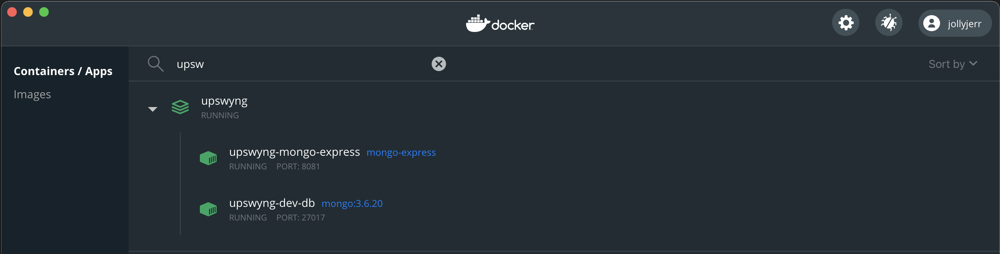

# UpSwyng Server

This workspace includes:

- an API server which provides data to the UpSwyng client
- an admin web interface which uses the [Svelte](https://svelte.dev/) framework to create and modify data for the project

## Setup

> You do not need to follow these steps if you are using `yarn start:local` because everything will already be set up for you

_Note: This project is built upon [Sapper](https://github.com/sveltejs/sapper), which uses a combination of [Svelte](https://svelte.dev/) and [Polka](https://github.com/lukeed/polka) to build and serve the app._

### 1. Setup Local MongoDB

[Docker](https://docs.docker.com/docker-for-mac/) needs to be installed and running.

If you are not sure, run `docker` in your terminal.

From your root directory...

```
yarn build:local-db
```

You can start and stop the local database via your docker dashboard



You can also visit a [mongo-express](https://github.com/mongo-express/mongo-express) dashboard for data manipulation at http://localhost:8081

### 2. Create `.env`

For local development, you'll only need to create a copy of `.env.example` and name that copy `.env`.

You can do this via your system's file explorer or via the following terminal command while in the repo:

```console
cd packages/server
cp .env.example .env
```

At minimum, the following values will need to exist to connect to your local database:

```
DATABASE_PASSWORD=upswyng123
DATABASE_SESSION_SECRET=
DATABASE_URL=mongodb://localhost:27017/upswyng-dev
DATABASE_USER=upswyng-dev-user
```

This file contains placeholders for various API keys that you may or may not need to provide. This depends on the issue you are addressing. For example, if you're working on a feature that is only enabled for admins, then you'll also need to provide API keys for one of our OAuth providers.

<details>
  <summary>Instructions for configuring Google Maps APIs (optional)</summary>
  
*These steps are only necessary if you would like to use the location search feature on the provider portal.*
     
1. If you have not already created a project on the [Google Cloud Platform](https://cloud.google.com/) for use with OAuth, create a new project now.
2. Click '+ ENABLE APIS AND SERVICES' on the API dashboard, search for 'Maps JavaScript API', then select and enable.
3. Now enable the 'Places API' in the same way.
4. Select 'Credentials' on the menu to the left, then '+ CREATE CREDENTIALS' then 'API Key'
5. Copy and paste this newly created API key to the `SERVER_GOOGLE_CLOUD_API_KEY` field of the server `.env` file. 
</details>

### 2. Start the Server

```console
yarn workspace @upswyng/server dev
```

Runs the server in the development mode. Open [http:/localhost:3000](http:/localhost:3000) to view it in the browser.

If you want to work on the [provider portal](http://localhost:3000/provider), you can log in with this google user:

```
username: dev.upswyng@gmail.com
password: upswyng123
```

This user has super admin privileges on local development databases

## Commands

### `yarn`

Installs project dependencies.

### `yarn dev`

Runs the app in the development mode.
Open [http://localhost:3000](http://localhost:3000) to view it in the browser.

The page will reload if you make edits. You will also see any lint errors in the console.

### `yarn test`

Launches both unit and end-to-end tests.

### `yarn test:e2e`

Launches end-to-end tests.

### `yarn test:unit`

Launches unit tests.

### `yarn build`

Start a production version of the app. This will disable live reloading, and activate the appropriate bundler plugins.

## Framework

### [Sapper](https://sapper.svelte.dev/)

Is a framework to blend server & client side with minimal extra code.

[Introduction blog](https://svelte.dev/blog/sapper-towards-the-ideal-web-app-framework)

You'll find a map to api routes generated by [Sapper](https://www.npmjs.com/package/sapper) within the path:

`server/src/node_modules/@sapper/internal/manifest-server.mjs`